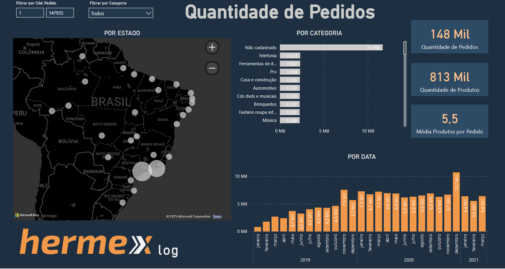
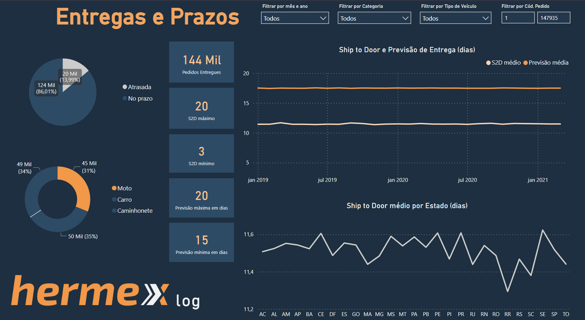
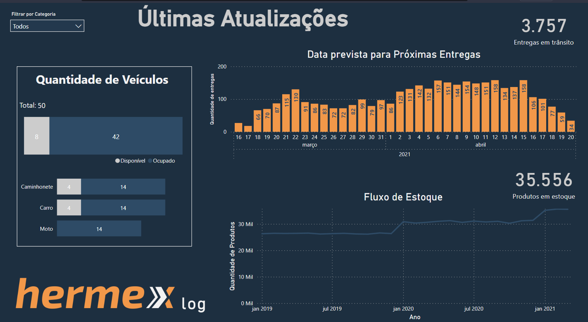

# HERMEX LOG

Projeto de DataViz para analisar indicadores da empresa de logística Hermex Log, com dados de 2019 até 2021. O dashboard foi desenvolvido no Power BI, com o objetivo principal de analisar a distribuição de pedidos em todo território nacional, entender KPIs como Ship to Door e entregas fora do prazo, além de acompanhar em tempo real o fluxo de estoque e veículos disponíveis.

[Dados](base-de-dados-Hermex.xlsx) utilizados, fornecido pela empresa.

[Arquivo editável](Hermex_Logistica.pbix) do Power BI. 

Acesso ao dashboard completo [aqui](https://app.powerbi.com/view?r=eyJrIjoiM2VjODNhNzctMDk4Yi00NWJhLTk4NTctY2ZkNjFlMmQxYTllIiwidCI6ImMwMGMyNzg3LTI3NmItNDE4ZC1iZjFjLTFkOTVhNDY3NTZjZSJ9&pageName=ReportSection0cde4b4b89aa96648809)

